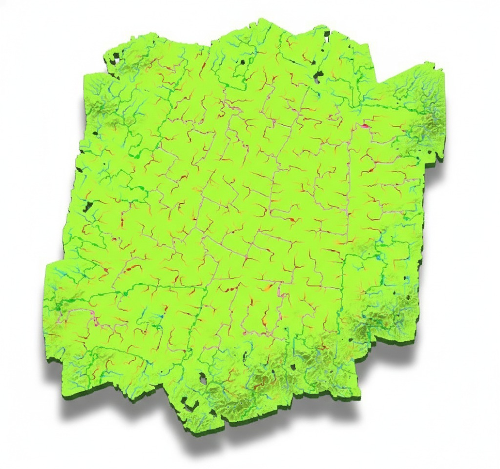

# ECO-HYDRO-AI

## Autonomous Digital Terrain Synthesis and Resilient Drainage Optimization

**Team Dupahar**  
**Theme:** Sustainable Development and Environment  
**Mission:** Safeguard India's Abadi villages from chronic waterlogging using physics-informed AI, high-resolution drone terrain intelligence, and fast flood simulation.

---

## Visual Showcase

<p align="center">
  
</p>

<p align="center">
  <em>Live flyover view of village-scale flood behavior in Dariyapur.</em>
</p>

<p align="center">
  
  
  
</p>

<p align="center">
  <em>From left to right: cinematic terrain render, velocity-field visualization, and GIS-style flood output.</em>
</p>

---

## Why This Repository Exists

Rural drainage systems fail for a simple reason: most of them are designed without true ground intelligence.

In dense Abadi settlements, narrow lanes, raised building plinths, vegetation, and clutter distort the terrain signal. Standard satellite products are too coarse. Traditional workflows often confuse buildings with land. Water then gets routed through places it should never go.

This repository is the working project space for **Eco-Hydro-AI**, a digital twin platform that turns drone-derived terrain data into flood-aware drainage intelligence.

It is built to answer one practical question:

**If monsoon water hits a village today, where will it actually go, how deep will it get, and what should be changed in the drainage layout to keep the settlement moving?**

---

## What Makes This Different

This is not just a visualization project. It is a full pipeline:

1. **Semantic terrain reconstruction**
   Rebuilds bare-earth terrain beneath buildings, vegetation, and clutter using AI.

2. **Physics-informed flood prediction**
   Simulates water movement using graph neural networks trained against hydraulic ground truth.

3. **Drainage-aware digital twin outputs**
   Produces flood maps, accessibility views, cinematic visualizations, and engineering-ready artifacts.

4. **Village-scale decision support**
   Converts centimeter-scale survey data into actionable drainage planning intelligence.

---

## Core Idea

```text
Drone LiDAR + Orthophoto + Settlement Semantics
                    |
                    v
        Semantic Terrain Synthesis (Sonata-MAE)
                    |
                    v
      Bare-Earth DTM with Building-Aware Corrections
                    |
                    v
      SWMM / Hydrology Ground Truth + Graph Construction
                    |
                    v
   Physics-Informed Flood GNN (DUALFloodGNN surrogate)
                    |
                    v
   Flood Depth + Flow Paths + Access Risk + Digital Twin Outputs
```

---

## Project Highlights

- Targets **village-scale rural waterlogging**, not generic urban flood visualization.
- Uses **3-5 cm GSD drone data** rather than coarse satellite-only terrain.
- Handles the **geometric shortcut problem** by distinguishing built structures from actual ground.
- Uses **physics-aware graph modeling** so water moves through alleys and realistic drainage paths.
- Supports a **10x-100x faster surrogate simulation path** compared with full numerical exploration workflows.
- Designed for **engineering decisions**, not just pretty maps.

---

## Results Snapshot

- Validated across **multiple Uttar Pradesh village datasets**.
- Bare-earth reconstruction targets **centimeter-scale vertical fidelity**.
- Flood modeling is designed around **mass conservation and physically plausible routing**.
- Project framing targets **30-40% reduction in drainage lifecycle cost** through better planning and fewer redesigns.
- Built for national relevance using already available **SVAMITVA-style drone survey assets**.

---

## Repository Atlas

This repository is not a minimal code sample. It is a working project archive containing models, experiments, outputs, presentations, and supporting assets.

### Top-level folders

- `GodTier/`
  The most advanced integrated workspace in this repo. Includes training code, Java visualization components, reports, metrics, and production-style outputs.

- `DTM_Flood_Prediction_Final_Submission/`
  Submission package organized into executive summary, code, documentation, results, visualizations, presentation materials, datasets, and supporting material.

- `Point-Cloud/`
  Raw or intermediate point-cloud related assets.

- `Training Data Set ORI & SHP File/`
  Training-oriented source material and shape-based data assets.

- `OutPut Testing ORI/`
  Output and testing-oriented artifacts.

- `ue5_flood_automator.py`
  Utility script related to Unreal Engine driven flood automation workflows.

---

## Fast Navigation

If you are opening this repo for the first time, use this route:

1. Start with `DTM_Flood_Prediction_Final_Submission/README.txt`
2. Review `GodTier/README.md`
3. Explore the training and inference code in `GodTier/`
4. Open the rendered outputs and submission material for the complete story

---

## System Stack

### AI and Modeling

- Python
- PyTorch
- Graph neural networks
- Semantic terrain synthesis
- Physics-informed surrogate flood modeling

### Simulation and Hydrology

- SWMM-style hydraulic ground truth workflows
- Drainage graph construction
- Building-aware conductivity constraints
- Flood depth and accessibility estimation

### Visualization and Delivery

- Python visualization scripts
- Java / JavaFX visualization components
- GIS-ready exports
- Cinematic render outputs
- Presentation-grade assets for demos and review

---

## Intended Use Cases

- Rural drainage redesign
- Monsoon flood-risk analysis for dense villages
- Emergency access planning
- Corridor accessibility assessment
- Bare-earth terrain recovery from cluttered drone captures
- Digital twin demonstrations for governance and infrastructure planning

---

## Why It Matters

India has already invested heavily in drone-based village mapping and rural sanitation infrastructure. The missing layer is not data collection. The missing layer is **intelligence**.

Eco-Hydro-AI closes that gap by turning existing terrain survey assets into a hydrology-aware operational system. The goal is straightforward: stop building drains that look correct on paper but fail under actual village topography.

---

## Repository Character

This repo is intentionally dense.

It contains:

- research code
- training pipelines
- simulation support utilities
- submission collateral
- rendered visuals
- documentation
- evaluation outputs

Think of it less like a toy repository and more like a **field lab plus submission vault plus digital twin workshop**.

---

## Recommended Cleanup Path

If this repository is being prepared for public presentation or long-term maintenance, the next sensible step is to split it into:

1. `core-models`
2. `visualization-demo`
3. `datasets-private`
4. `submission-assets`

That separation would make collaboration, review, and deployment significantly cleaner.

---

## Team Dupahar

**Autonomous Digital Terrain Synthesis and Resilient Drainage Optimization** is built around one central idea:

**make hidden terrain visible, make water behavior predictable, and make rural drainage decisions defensible.**

---

## Status

This repository currently reflects an active project archive with code, outputs, and submission material already pushed to GitHub.

If you are evaluating the work, start with the submission package and then move into the `GodTier/` implementation space.